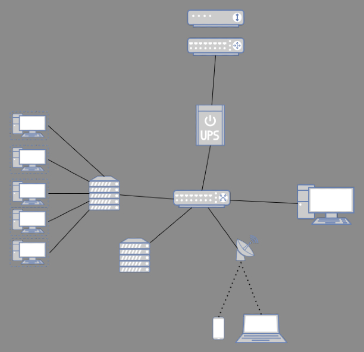
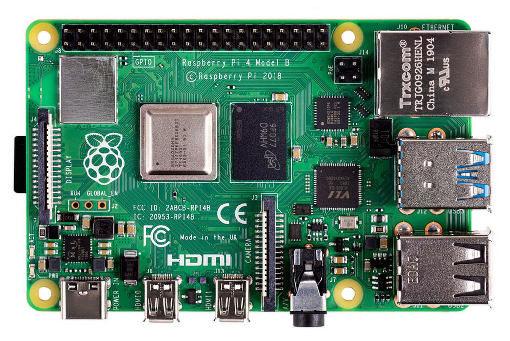
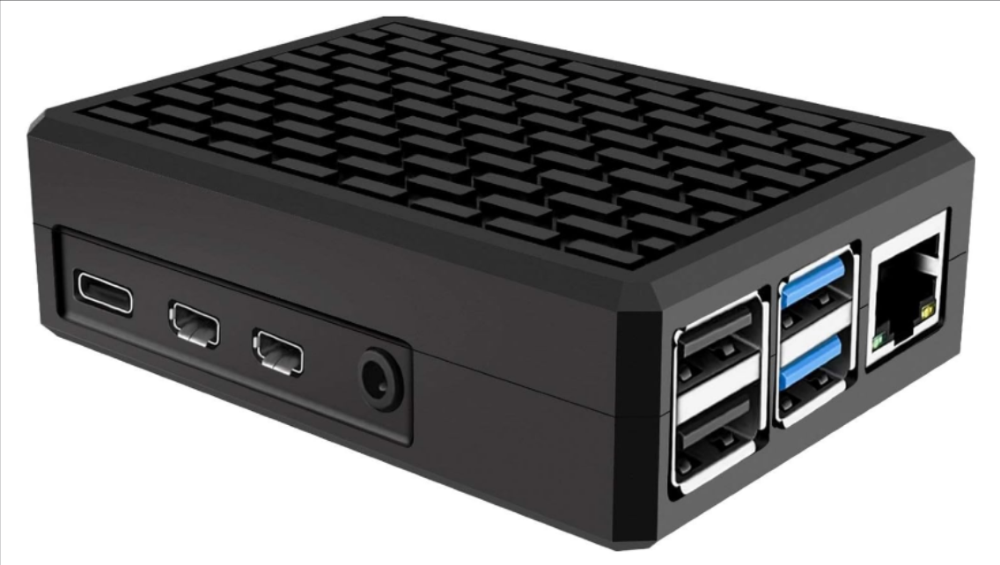
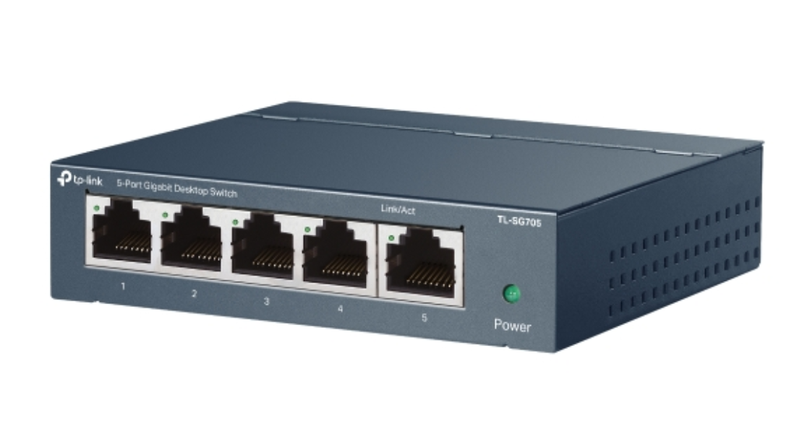
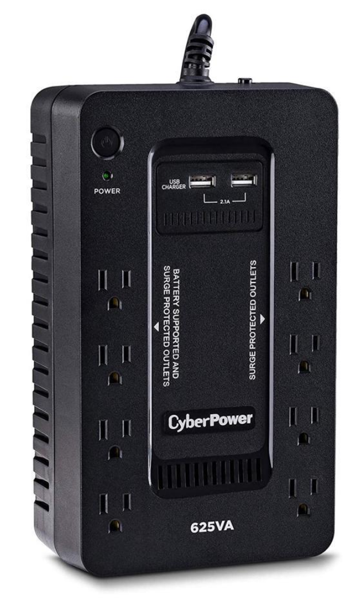

# The Empire - Homelab

**Builder:** Gleb Goodkovsky

---

## Diagram

***(Temporary diagram to show approxmiate homelab setup)***

---

## Current Hardware

<strong>Raspberry Pi 4 Model B Rev 1.5</strong>

- 4GB RAM
- SanDisk 32GB SD Card
- Raspberry Pi 4 Case, Miuzei Aluminium

<strong>Lenovo ThinkCentre M710S SFF</strong>

- i5 6600, 3.20GHz
- 32GB DDR4 RAM (4x8GB - Upgraded)
- 256GB Enterprise SSD (Boot/VMs)

<strong>Networking & Power</strong>

- **TP-Link TL-SG105:** 5 Port Gigabit Unmanaged Switch
- **CyberPower ST625U UPS:** 625VA / 360W (USB-HID linked to Host)
- **Telus WiFi Booster:** Primary Uplink
- **DEWENWILS 1ft Extensions:** Power spacing for high-density shelf

---

## Current Software

<strong>Raspberry Pi 4</strong>

- **OS:** Raspberry Pi OS Lite (64-bit)  
  - [Official OS site](https://www.raspberrypi.com/software/operating-systems/)
- **Services:**
  - Pi-hole — [Official site](https://pi-hole.net/)
  - Tailscale — [Official site](https://tailscale.com/)

<strong>Lenovo ThinkCentre</strong>

- **Hypervisor:** Proxmox VE 9.1  
  - [Official OS site](https://www.proxmox.com/en/)

<strong>VM 100 — db-mc-server</strong>

- **OS:** Debian 13  
  - [Official OS site](https://www.debian.org/)
- **Specs:** 
  - 8 GB RAM
  - 3 Cores
  - 40 GB Storage
- **Ingress:** Playit.gg Tunnel — [Official site](https://playit.gg/)

<strong>LXC 101 — uptime-kuma</strong>

- **OS:** Debian 12  
  - [Official OS site](https://www.debian.org/)
- **Specs:** 
  - 0.5 GB RAM
  - 1 Core
  - 4 GB Storage
- **Role:** Service Heartbeat Monitoring — [Uptime Kuma](https://uptime.kuma.pet/)

<strong>LXC 102 — syncthing</strong>

- **OS:** Debian 12  
  - [Official OS site](https://www.debian.org/)
- **Specs:** 
  - 0.5 GB RAM
  - 1 Core
  - 5 GB Storage
- **Role:** Syncing files — [Syncthing](https://syncthing.net/)

<strong>LXC 103 — web-static</strong>

- **OS:** Debian 12  
  - [Official OS site](https://www.debian.org/)
- **Specs:** 
  - 0.25 GB RAM
  - 1 Core
  - 4 GB Storage
- **Role:** Cloudflare Tunnel Entrypoint — [Cloudflare](https://www.cloudflare.com/)

<strong>LXC 104 — n8n-automation</strong>

- **OS:** Debian 12 (Docker)  
  - [Official OS site](https://www.debian.org/)
- **Specs:** 
  - 2 GB RAM
  - 1 Core
  - 8 GB Storage
- **Role:** Sovereign n8n Logic Engine — [n8n](https://n8n.io/)

---

## Operational Protocols

<strong>The Power Protector</strong>

- **Logic:** NUT (Master) -> n8n Webhook -> Multi-Node SSH Kill Chain -> Host Shutdown.
- **Resilience:** Local-IP triggered to bypass external network failure.

<strong>Intelligence Dashboard</strong>

- **Interface:** Telegram Bot
- **Commands:** 
  - `/stats pve`: get stats of pve and all LXCs
  - `/stats vm`: get stats of vm
  - `/stats pi`: get stats of pi
  - `/stats help`: get stat command list
  - `/update`: Manual trigger for safe serverwide update sequence.

